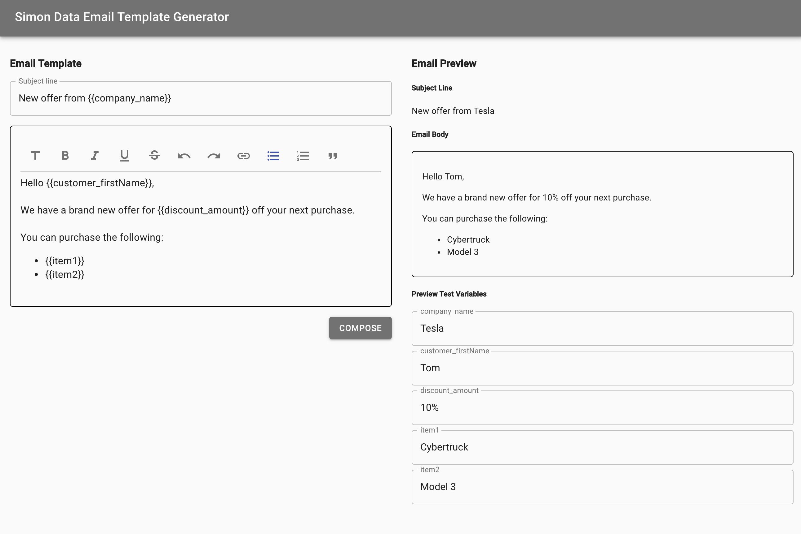

# Email Template Generator and Sender

Provides the ability to define a template in their user’s product and then use that template to send emails to their user’s customers.




Created from:
-   [create-react-app-material-typescript-redux](https://github.com/innFactory/create-react-app-material-typescript-redux)
-   [hello-nodejs-typescript](https://github.com/larkintuckerllc/hello-nodejs-typescript)

Merged together to form a monolith Express/React Stack.

## Installation

1.  ```npm install```
2.  create a file named `.env` in the root dir of the project
    ```
    # server vars
    SERVER_PORT=<your port>
    NODE_HOST=http://<your domain>,
    CLIENT_HOST=http://<your domain>,
    SENDGRID_API_KEY=<your Sendgrid api key>
    # TEST_MAIL=yes
    # SERVER_SERVE_REACT=yes
    
    # WARNING: prefix "REACT_APP_" to all env vars for react
    REACT_APP_API_HOSTNAME=http://<your domain>
    ```
    

### Development
Launch in separate terminals:
-   `npm run server_watch`
-   `npm run server_node`
-   `npm run client_start`

### Production

-   `npm run build_prod`

Run node server in `dist/server/server.js`

### Testing

-   `npm run client_test`


## Future Enhancements

-   100% code coverage for UI components & Utilities
-   100% code coverage for api controller endpoints
-   Allow to submit a batch of emails e.g. list of recipients
-   Provide persistence through user accounts
-   Input validation: emails and valid templates

